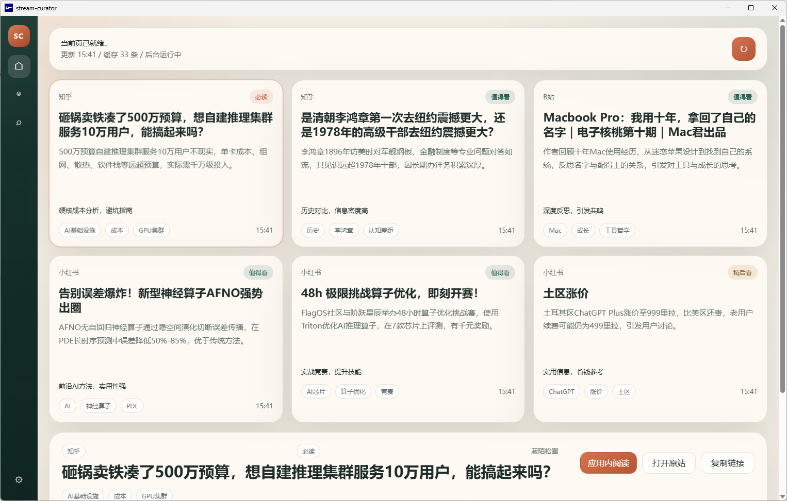
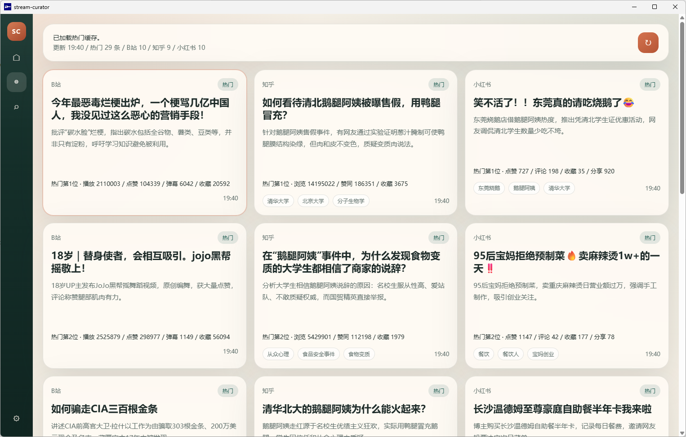
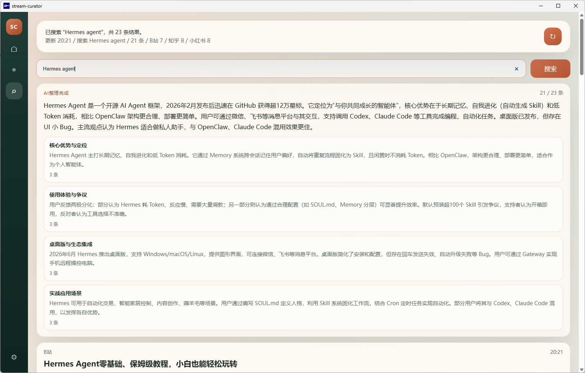

# stream-curator

<p align="center">
  
</p>

`stream-curator` 是一个给个人使用的桌面端信息筛选应用。  
当前接入 `Bilibili`、`知乎`、`小红书` 三源，把首页推荐、热门和搜索结果整理成一个统一客户端：先抓取原始内容，再补正文，再交给 LLM 做摘要、筛选和整理，最后在应用内阅读。

## 当前功能

### 1. 推送

- 从三源抓取首页推荐内容
- 对候选条目做 hydrate，尽量补齐正文、简介、字幕、回答、笔记正文、少量评论
- 交给 LLM 生成推送卡片：标题、摘要、推荐理由、标签
- 首页一次展示 6 张卡片
- 刷新优先读取已经缓存好的内容，缓存不足时后台 worker 继续补

### 2. 热门

- 三源分别抓取热门内容
- 热门页缓存按小时刷新
- 不做和推送完全一样的强筛选，更偏向“当前值得扫一眼的内容汇总”

### 3. 搜索

- 先返回即时搜索结果
- 后台再跑一轮 AI 整理
- 顶部显示“AI 整理中 / AI 整理完成”
- LLM 会输出长摘要和分组结果，尽量去掉过时或不相关项

### 4. 统一阅读页

- `Bilibili`：应用内播放器 + 简介 + 评论分页
- `知乎`：支持 question / answer / article，question 会在阅读页里切换多个回答
- `小红书`：正文、图片、评论分页
- 阅读页和卡片页共用一个客户端，不需要来回切浏览器

## 页面示意

### 推送页



### 热门页



### 搜索页



## 仓库结构

```text
stream-curator/
  desktop/                 Electron 外壳与打包脚本
  examples/                README 截图
  frontend/                前端页面与交互
  src/stream_curator/      后端逻辑
  third-party/             三个上游 CLI fork 与本地 wrapper
  tests/                   当前仍保留的有效测试
```

## 运行方式

推荐分两种方式使用：

1. 开发态：本地 Python + 本地三个上游 CLI + Electron
2. 发布包：直接解压 `zip` 后运行 `stream-curator.exe`

## 克隆仓库

三个上游 CLI fork 以 submodule 的形式放在 `third-party/@...` 下。首次克隆推荐直接带上它们：

```powershell
git clone --recurse-submodules <your-stream-curator-repo>
```

如果主仓库已经 clone 完，再补一次：

```powershell
git submodule update --init --recursive
```

## 开发环境要求

- Windows
- Python 3.11
- Node.js
- 已初始化的 `third-party/@bilibili-cli`
- 已初始化的 `third-party/@zhihu-cli`
- 已初始化的 `third-party/@xiaohongshu-cli`

默认配置下，程序会优先走仓库内的本地 wrapper：

- `third-party/bin/bili.cmd`
- `third-party/bin/zhihu.cmd`
- `third-party/bin/xhs.cmd`

如果你想强制改成别的可执行文件，可以用环境变量覆盖：

- `STREAM_CURATOR_BILIBILI_EXECUTABLE`
- `STREAM_CURATOR_ZHIHU_EXECUTABLE`
- `STREAM_CURATOR_XIAOHONGSHU_EXECUTABLE`

## CLI 用法

先初始化 SQLite：

```powershell
$env:PYTHONPATH = (Resolve-Path .\src)
python -X utf8 -m stream_curator.cli bootstrap
```

如果你希望当前 Python 进程和三个本地 wrapper 共用同一个解释器，推荐显式加上：

```powershell
$env:STREAM_CURATOR_PYTHON_EXECUTABLE = (Get-Command python).Source
```

读取当前推送页：

```powershell
python -X utf8 -m stream_curator.cli client push
```

刷新推送页：

```powershell
python -X utf8 -m stream_curator.cli client push --refresh
```

读取热门页：

```powershell
python -X utf8 -m stream_curator.cli client hot
```

刷新热门页：

```powershell
python -X utf8 -m stream_curator.cli client hot --refresh
```

执行一次搜索：

```powershell
python -X utf8 -m stream_curator.cli client search "agent"
```

强制重跑该搜索的 AI 整理：

```powershell
python -X utf8 -m stream_curator.cli client search-review "agent" --force
```

运行一次后台 worker：

```powershell
python -X utf8 -m stream_curator.cli worker once
```

常驻后台 worker：

```powershell
python -X utf8 -m stream_curator.cli worker start
python -X utf8 -m stream_curator.cli worker status
python -X utf8 -m stream_curator.cli worker stop
```

## Desktop 用法

启动桌面端：

```powershell
cd desktop
npm install
npm start
```

桌面端当前提供：

- 推送 / 热门 / 搜索 三个主视图
- 左下角设置页
- 应用内登录页
- 应用内统一阅读页
- 推送刷新、热门刷新、搜索 AI 整理状态展示

桌面端解析上游 CLI 的顺序是：

1. `STREAM_CURATOR_*_EXECUTABLE` 显式覆盖
2. 发布包内置 wrapper
3. 仓库内 `third-party/bin/*.cmd`
4. 旧的外部 `Scripts/*.exe` 回退路径

## 登录设置

推荐直接在桌面端里完成：

1. 启动客户端
2. 点击左下角设置
3. 选择 `Bilibili / 知乎 / 小红书`
4. 在应用内打开对应登录页
5. 完成登录后点击“保存登录”

说明：

- 登录状态最终仍然落在三个上游 CLI 各自使用的本地会话里
- 桌面端的职责是把登录页嵌进来，并提交当前登录上下文
- 如果你已经手动用上游 CLI 登录过，客户端也会读取到对应状态

## LLM 设置

同样在桌面端设置页完成：

- `API URL`
- `Model`
- `API Key`

当前默认值：

- URL: `https://opencode.ai/zen/go/v1/chat/completions`
- Model: `deepseek-v4-flash`

说明：

- `API Key` 在界面里是隐藏输入
- 配置会保存到 `data/app-settings.json`
- 也可以用环境变量覆盖：
  - `STREAM_CURATOR_LLM_API_KEY`
  - `STREAM_CURATOR_LLM_CHAT_COMPLETIONS_URL`
  - `STREAM_CURATOR_LLM_MODEL`
  - `OPENCODE_API_KEY`

优先级上，显式的 `STREAM_CURATOR_*` 环境变量高于本地设置文件。

## 打包

### 便携目录

```powershell
cd desktop
npm run build:portable
```

输出目录：

- `desktop/dist/stream-curator-win32-x64/`

这个版本仍然依赖你本机已有的 Python 环境和三个上游 CLI。
如果你已经初始化了 `third-party` submodule，并且当前 Python 环境具备三个 CLI 的运行依赖，也可以直接走仓库内 wrapper。

### 自包含发布包

```powershell
cd desktop
npm run build:release
```

输出文件：

- `desktop/dist/stream-curator-release.zip`

这个压缩包会带上：

- Electron runtime
- 精简后的 Python runtime
- `stream-curator` 源码
- 三个上游 CLI 的可执行包装

解压后直接运行 `stream-curator.exe` 即可。  
外部仍需你自己提供有效的登录状态和 LLM 配置。

## 测试

当前测试只保留仍然和现有功能对应的部分，主要覆盖：

- connector 映射
- push / hot / search 核心服务
- SQLite 存储
- worker 进程状态
- 阅读页评论分页

运行：

```powershell
pytest
```

## 当前依赖的上游项目

`stream-curator` 依赖三套独立 CLI 做抓取与登录态承载：

- `bilibili-cli`
- `zhihu-cli`
- `xiaohongshu-cli`

现在这三个 fork 已经作为 submodule 挂在：

- `third-party/@bilibili-cli`
- `third-party/@zhihu-cli`
- `third-party/@xiaohongshu-cli`

本仓库只负责统一调度、缓存、LLM 整理、桌面端展示和阅读体验。

## 许可证

本仓库主代码使用 [Apache License 2.0](LICENSE)。

注意：

- `third-party/@...` 下的三个子模块不自动并入本仓库许可证
- 它们仍然分别遵循各自仓库的许可证
